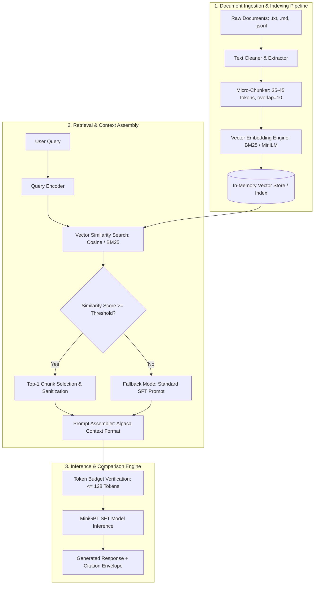

# Phase 7A: RAG Architecture and Requirements Specification

**Project:** MiniGPT (Model C Baseline — 6.61M Parameters)
**Status:** Frozen Baseline Design / Architectural Audit (Phase 7A)
**Context Window Limit:** 128 Tokens (Strict Constraint)
**Baseline Git Commit:** `3015a1a`

---

## 1. Executive Summary & Baseline Context

Phase 7 introduces Retrieval-Augmented Generation (RAG) to the MiniGPT ecosystem. MiniGPT Model C is a compact, highly optimized micro-transformer with 6,613,504 parameters, trained on FineWeb-Edu and fine-tuned via SFT on Alpaca-style instruction datasets.

### Current Frozen Baseline Specifications

| Parameter / Artifact | Specification / Path |
| :--- | :--- |
| **Model Architecture** | MiniGPT Model C (8 layers, 8 heads, 256 embd) |
| **Parameter Count** | 6,613,504 parameters |
| **Context Length (`block_size`)** | 128 tokens |
| **Vocabulary Size** | 1,024 (BPE Tokenizer) |
| **Base Model Checkpoint** | `checkpoints/phase5d/model_6_61m/best_model.pt` |
| **SFT Checkpoint** | `checkpoints/phase6/model_c_sft/best_model.pt` |
| **Tokenizer Artifact** | `tokenizers/phase5d/bpe_vocab_1024.json` |
| **Baseline Test Perplexity** | 19.9101 |
| **SFT Test Perplexity** | 13.5777 (31.81% improvement) |
| **Full Test Suite Status** | 92 / 92 PASS |

---

## 2. RAG System Architecture Overview

The Phase 7 RAG system bridges internal parametric memory (MiniGPT Model C SFT) with non-parametric external knowledge stores without altering the model context length or pretrained positional embeddings.



---

## 3. End-to-End Component Design

### 3.1 Document Ingestion & Text Extraction
- **Supported Formats:** Plain text (`.txt`), Markdown (`.md`), and JSON Lines (`.jsonl`).
- **Extraction Protocol:** UTF-8 encoding parser with whitespace normalization, strip control characters, and header preservation.
- **Document Metadata:** Document ID, source filename, total character count, creation timestamp, and domain tag.

### 3.2 Chunking Strategy (Micro-Chunking for 128-Token Limit)
Given MiniGPT's 128-token context window, standard chunk sizes (256–512 tokens) cannot be used.
- **Chunk Size Target:** 35 to 45 tokens (~120 to 180 characters using BPE 1024 vocabulary).
- **Chunk Overlap:** 10 to 12 tokens (~35 to 45 characters) to preserve contextual boundaries across sentences.
- **Chunking Method:** Sentence-aware sliding window. Splits on sentence delimiters (`.`, `?`, `!`, `\n`) while respecting maximum token constraints.
- **Chunk Metadata Schema:**
  ```json
  {
    "chunk_id": "doc_001_chk_002",
    "doc_id": "doc_001",
    "content": "MiniGPT Model C has 6.61M parameters and 8 transformer layers.",
    "token_count": 18,
    "start_char": 42,
    "end_char": 105,
    "source": "minigpt_spec.md"
  }
  ```

### 3.3 Embedding Strategy & Vector Database
- **Embedding Approach:**
  - **Primary (Zero-Dependency / Micro):** BM25 / TF-IDF hybrid lexical embedding using the existing BPE tokenizer. Ensures zero external heavyweight dependencies and exact alignment with subword token distribution.
  - **Secondary (Dense):** Lightweight Sentence-Transformers (`all-MiniLM-L6-v2`, 384 dimensions) for semantic vector comparison.
- **Vector Database Selection:** Custom In-Memory Vector Store (`JSON` + `NumPy`). Lightweight, fast, fully serializable, and memory-efficient for small document collections (< 100,000 chunks). Avoids heavy external services like Pinecone or Chroma.

### 3.4 Similarity Search & Retrieval Strategy
- **Distance Metric:** Cosine Similarity for dense vectors; BM25 score for lexical tokens.
- **Top-K Selection:** `top_k = 1` (Primary). Because the context limit is 128 tokens, retrieving 1 highly relevant chunk (35-45 tokens) leaves adequate space for prompt formatting, question text, and generation reserve.

### 3.5 Context Construction & Prompt Formatting
To maintain consistency with Phase 6 SFT, RAG context is injected using an extended Alpaca instruction template:

```text
Instruction:
<user_query>

Context:
<retrieved_chunk_text>

Response:
```

### 3.6 Answer Generation & Fallback Mechanism
- **Similarity Threshold:** Minimum similarity score $S_{\min} = 0.25$ (Cosine) or $BM25 \ge 1.5$.
- **Fallback Behavior:** If top retrieved chunk score is below threshold:
  - System logs "Low confidence retrieval (< $S_{\min}$)".
  - System bypasses Context section and formats prompt as standard Phase 6 SFT instruction.
  - Prevents noisy/irrelevant context from degrading generation quality.

### 3.7 Source Attribution & Citation Envelope
Citations are not injected into the LLM context (saving precious context tokens). Instead, citation metadata (`source`, `chunk_id`) is attached at the API/UI response wrapper layer.

---

## 4. Context Budget Calculation (Strict 128-Token Limit)

MiniGPT's pretrained positional embedding matrix is fixed at `block_size = 128`. RAG prompt construction must guarantee that total tokens never exceed 128.

### 4.1 Detailed Context Allocation Budget

| Component | Target Token Count | Character Approx. (BPE 1024) | Description / Example |
| :--- | :---: | :---: | :--- |
| **Template Overhead** | 18 tokens | ~60 chars | `Instruction:\n...\n\nContext:\n...\n\nResponse:\n` |
| **User Query (`instruction`)** | 22 tokens | ~75 chars | e.g. "What is the parameter count of MiniGPT?" |
| **Retrieved Context Chunk** | 42 tokens | ~150 chars | e.g. "MiniGPT Model C has 6.61M parameters and 8 layers..." |
| **Response Generation Reserve** | 46 tokens | ~160 chars | Output buffer for model generation |
| **TOTAL BUDGET** | **128 tokens** | **~445 chars** | **100% of Model `block_size` Limit** |

### 4.2 Dynamic Context Truncation Guardrail Algorithm
```python
def enforce_rag_context_budget(query_tokens, context_tokens, max_block_size=128, min_gen_reserve=35):
    template_overhead = 18
    available_for_context = max_block_size - min_gen_reserve - template_overhead - len(query_tokens)

    if available_for_context < 15:
        # Context cannot fit effectively; drop context to preserve instruction and generation
        return [], "dropped_due_to_budget"

    if len(context_tokens) > available_for_context:
        context_tokens = context_tokens[:available_for_context]

    return context_tokens, "fitted"
```

---

## 5. Comparison Pipeline Design

Phase 7 establishes a 3-way evaluation harness to benchmark progress:

```text
1. BASE MODEL (Pretrained Model C)
   Input: Raw text query / prompt
   Output: Un-tuned completion from base pretraining

2. SFT MODEL (Phase 6 SFT Model C)
   Input: Alpaca Instruction Format
   Output: Instruction-tuned response relying on internal parametric weights

3. SFT + RAG MODEL (Phase 6 SFT Model C + Phase 7 Retriever)
   Input: Extended Alpaca Instruction + Retrieved Micro-Chunk
   Output: Grounded response conditioned on external non-parametric context
```

---

## 6. Evaluation Dataset & Benchmark Plan

A controlled benchmark dataset (`phase7/data/eval_rag_dataset.json`) containing 30 factual questions paired with source knowledge documents will be constructed.

### Evaluation Categories
1. **In-Domain Parametric Facts:** Questions about facts present in pretraining/SFT data.
2. **Novel Non-Parametric Facts:** Specific synthetic or updated facts NOT in pretraining data (tests true RAG utility).
3. **Out-of-Domain / Fallback Queries:** Queries with no relevant context in vector store (tests fallback mechanism).

---

## 7. Metrics & Measurement Framework

| Category | Metric | Definition / Formula | Target Threshold |
| :--- | :--- | :--- | :--- |
| **Retrieval** | **Recall@1** | $\frac{\text{Relevant Chunks Retrieved in Top 1}}{\text{Total Ground Truth Chunks}}$ | $\ge 85.0\%$ |
| **Retrieval** | **MRR (Mean Reciprocal Rank)** | $\frac{1}{\|Q\|} \sum_{i=1}^{\|Q\|} \frac{1}{\text{rank}_i}$ | $\ge 0.85$ |
| **Quality** | **Answer Correctness (Token Jaccard)** | $\frac{\|T_{\text{gen}} \cap T_{\text{exp}}\|}{\|T_{\text{gen}} \cup T_{\text{exp}}\|}$ | $\ge 0.45$ (SFT+RAG > SFT) |
| **Quality** | **Exact Substring Match** | Binary check if key fact substring is present in generation | $\ge 70.0\%$ |
| **Safety** | **Groundedness / Faithfulness** | Proportion of generated facts present in context chunk | $\ge 80.0\%$ |
| **Safety** | **Hallucination Rate** | Proportion of assertions absent from context chunk | $\le 15.0\%$ |
| **Performance**| **Retrieval Latency** | Time to encode query + search vector index (ms) | $< 5.0\text{ ms}$ |
| **Performance**| **Generation Latency** | Time for model forward pass + sampling (ms) | $< 150.0\text{ ms}$ |

---

## 8. Risk Analysis & Mitigation Matrix

| Identified Risk | Severity | Root Cause | Architectural Mitigation |
| :--- | :--- | :--- | :--- |
| **Context Overflow (>128 tokens)** | CRITICAL | Query or context chunk exceeds budget | Hard token counting guardrail & dynamic truncation prior to tokenization. |
| **Tiny Model Capacity (6.61M)** | HIGH | Small model may ignore context or hallucinate | Micro-chunking (35-45 tokens) to minimize distraction; strict Alpaca prompt alignment. |
| **Noisy / Irrelevant Retrieval** | HIGH | Sub-optimal similarity match | Distance thresholding ($S_{\min} = 0.25$) with automatic fallback to standard SFT. |
| **Repetitive Generation** | MEDIUM | Dense prompt causes loop | Apply repetition penalty ($1.15$) and top-k ($40$) / top-p ($0.90$) sampling. |
| **Parametric Contradiction** | MEDIUM | Pretrained weights conflict with retrieved context | Prompt formatting explicitly instructs answering *only* from context. |

---

## 9. Proposed Directory Structure

```text
phase7/
├── PHASE7A_RAG_ARCHITECTURE.md   # Architectural & Requirements Specification (This document)
├── rag_architecture.json         # Machine-readable design specification & context budget schema
├── evaluation_spec.md            # Benchmark evaluation protocol & metric formulations
├── data/
│   ├── documents/                # Sample raw documents (.txt, .md, .jsonl)
│   └── eval_rag_dataset.json     # Controlled 30-item evaluation dataset spec
├── vector_store/                 # In-memory vector store index specifications
├── retrieval/                    # (Future Phase 7B) Chunker, Indexer, Search Engine
├── evaluation/                   # (Future Phase 7C) RAG vs SFT vs Base benchmark runner
└── ui/                           # (Future Phase 7D) RAG integration with Web Studio
```

---

## 10. Phase 7 Roadmap

1. **Phase 7A (Current):** Design, Requirements, Architecture Audit, Context Budget Definition, and Schema Verification.
2. **Phase 7B:** Document Ingestion, Micro-Chunking, Vector Store, and Retriever Pipeline Implementation.
3. **Phase 7C:** RAG Evaluation Harness & Comparative Benchmark (Base vs. SFT vs. SFT+RAG).
4. **Phase 7D:** Web Studio UI & API Integration with Source Citation & RAG Toggle.
