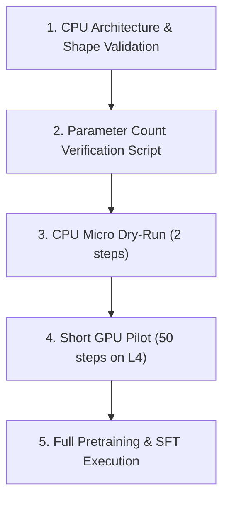

# Phase 8A: Controlled Model Scaling Experiment Design

> **Status**: DESIGN & ANALYSIS ONLY — DO NOT TRAIN / NO GPU POD ATTACHMENT  
> **Author**: Antigravity AI  
> **Date**: October 7, 2026  
> **Baseline Commit**: `2745326` (Complete Phase 7E end-to-end RAG evaluation)

---

## 1. Motivation & Context

In Phase 7, we implemented and evaluated an end-to-end Retrieval-Augmented Generation (RAG) system utilizing **Model C** (6.61M parameters). 
The evaluation established:
- **Retrieval Performance**: BM25 achieved **86.67% Recall@1** and **0.8667 MRR** with average retrieval latency of **0.84 ms**.
- **Generation Performance**:
  - Base Model C Exact Match: **0/30 (0.0%)**
  - Phase 6 SFT Exact Match: **0/30 (0.0%)**
  - Phase 6 SFT + RAG Exact Match: **0/30 (0.0%)**
  - Phase 7D-C RAG-SFT Exact Match: **0/8 (0.0%)**
- **Root Cause Analysis**: Out of 30 test cases, 26 cases had the **correct grounding document retrieved** in context, but the generator failed to synthesize or extract the correct exact answer substring.

This demonstrates that while retrieval is performing effectively, generation is bottlenecked. The fundamental open scientific question is whether small transformer models (~6.61M parameters) lack sufficient parameters to attend to, retain, and extract facts from provided contexts, or whether context-grounded generation failure is an architectural/training objective limitation.

---

## 2. Primary Research Question

> **"Does increasing model capacity materially improve context-grounded generation in MiniGPT?"**

---

## 3. Scientific Hypothesis

- **Hypothesis $H_1$ (Capacity Bottleneck)**: Increasing MiniGPT model capacity from 6.61M to ~15.16M (Model D) and ~29.49M (Model E) parameters will significantly improve context utilization, leading to non-zero exact match accuracy ($>0\%$) and higher token Jaccard similarity when grounding context is provided.
- **Null Hypothesis $H_0$ (Capacity Invariance)**: Increasing model capacity will reduce language modeling perplexity on pretraining data, but context-grounded generation exact match will remain at 0/30, demonstrating that model size alone does not resolve context-grounding failure without changing architecture, context window, or training objectives.

---

## 4. Audit of Existing Baseline Architecture

Inspected directly from repository source code ([model.py](file:///c:/Users/dell9/OneDrive/Desktop/minigpt/model.py), [phase5d_config.py](file:///c:/Users/dell9/OneDrive/Desktop/minigpt/phase5d_config.py), and [MODEL_C_GPU_REPORT.md](file:///c:/Users/dell9/OneDrive/Desktop/minigpt/results/phase5d/MODEL_C_GPU_REPORT.md)):

### Model C Architecture & Pretraining Parameters
- **Parameter Count**: `6,613,504` (6.61M)
- **Transformer Layers (`n_layer`)**: 8
- **Attention Heads (`n_head`)**: 8
- **Embedding Dimension (`n_embd`)**: 256
- **Head Dimension (`head_dim`)**: 32 (`256 / 8`)
- **Vocabulary Size (`vocab_size`)**: 1024 (Protected Phase 5D BPE Tokenizer: `tokenizers/phase5d/bpe_vocab_1024.json`, SHA-256: `6436b59303ef54cb91c6656f378f5a9bfb00fc55a3c2ad516ddf357cc58e3a5d`)
- **Context Length (`block_size`)**: 128 tokens
- **Positional Embeddings**: Learned absolute positional embeddings (`nn.Embedding(128, 256)`)
- **Normalization**: LayerNorm (`nn.LayerNorm`), Pre-LN block architecture
- **Activation Function**: GELU (`nn.GELU()`) in FeedForward network
- **Attention Mechanism**: Multi-Head Causal Self-Attention with causal mask (`torch.tril`), scaled dot-product `(Q @ K^T) / sqrt(d_k)`, softmax, dropout. Linear projections `c_attn` ($3 \cdot E$) and `c_proj` ($E$). Weight tying enabled (`wte.weight = lm_head.weight`).
- **Optimizer**: AdamW ($\beta_1=0.9, \beta_2=0.999$, weight decay = 0.0)
- **Learning Rate Schedule**: Linear warmup (50 steps, 0 $\to$ 1e-3) followed by cosine decay (step 50 $\to$ 2500, 1e-3 $\to$ 1e-4)
- **Training Token Budget**: 10,240,000 tokens (2,500 iterations $\times$ 32 effective batch size $\times$ 128 block size)
- **Phase 5D Pretraining Results**: Final Val Loss = **2.9699**, Val Perplexity = **19.49**, Val BPC = **2.1596**.

---

## 5. Proposed Model Scaling Matrix

To rigorously isolate model capacity as the independent variable, we maintain a constant head dimension ($d_{head} = 32$), sequence length ($block\_size = 128$), vocabulary ($vocab\_size = 1024$), and pre-LN MiniGPT decoder-only architecture across all candidate sizes.

### Architectural Scaling Table

| Model Identifier | Layers ($L$) | Heads ($H$) | Embedding Dim ($E$) | Head Dim ($d_h$) | Parameter Count | Scaling Factor (vs Model C) | Architecture Type |
| :--- | :---: | :---: | :---: | :---: | :---: | :---: | :--- |
| **Model A (Baseline)** | 4 | 4 | 128 | 32 | **940,800** (0.94M) | 0.14$\times$ | Decoder-Only Pre-LN GPT |
| **Model B (Baseline)** | 6 | 6 | 192 | 32 | **2,890,752** (2.89M) | 0.44$\times$ | Decoder-Only Pre-LN GPT |
| **Model C (Current)** | 8 | 8 | 256 | 32 | **6,613,504** (6.61M) | 1.00$\times$ | Decoder-Only Pre-LN GPT |
| **Model D (Candidate 1)** | 12 | 10 | 320 | 32 | **15,164,800** (15.16M) | 2.29$\times$ | Decoder-Only Pre-LN GPT |
| **Model E (Candidate 2)** | 12 | 14 | 448 | 32 | **29,488,256** (29.49M) | 4.46$\times$ | Decoder-Only Pre-LN GPT |

### Parameter Formula Verification
Total trainable parameters for MiniGPT architecture:
$$\text{Params} = V \cdot E + B \cdot E + L \cdot (12 E^2 + 13 E) + 2 E$$
*(where weight tying connects `wte` and `lm_head` without adding extra parameters).*

- **Model C Calculation**: $1024 \times 256 + 128 \times 256 + 8 \times (12 \times 256^2 + 13 \times 256) + 2 \times 256 = 294,912 + 6,318,080 + 512 = 6,613,504$
- **Model D Calculation**: $1024 \times 320 + 128 \times 320 + 12 \times (12 \times 320^2 + 13 \times 320) + 2 \times 320 = 368,640 + 14,795,520 + 640 = 15,164,800$
- **Model E Calculation**: $1024 \times 448 + 128 \times 448 + 12 \times (12 \times 448^2 + 13 \times 448) + 2 \times 448 = 516,096 + 28,971,264 + 896 = 29,488,256$

---

## 6. Controlled Training Budget & Hyperparameters

### Training Budget Rationale

10.24M tokens is a deliberately fixed experimental budget across all model sizes (2,500 iterations $\times$ 32 effective batch size $\times$ 128 block size). 
While standard heuristic scaling laws (such as Chinchilla) suggest token counts proportional to parameter counts, using a strictly fixed 10.24M token budget ensures that larger models receive the exact same data volume exposure as baseline models, isolating parameter capacity as the single variable under test without confounding token volume variance.

### Fixed Pretraining Hyperparameters

| Hyperparameter | Value | Notes |
| :--- | :--- | :--- |
| **Dataset** | FineWeb-Edu (`sample-10BT`) | Split: SHA-256 fixed partition |
| **Tokenizer Path** | `tokenizers/phase5d/bpe_vocab_1024.json` | Protected Phase 5D BPE Tokenizer (`vocab_size=1024`) |
| **Tokenizer SHA-256** | `6436b59303ef54cb91c6656f378f5a9bfb00fc55a3c2ad516ddf357cc58e3a5d` | Cryptographic verification |
| **Sequence Length (`block_size`)** | 128 tokens | Fixed context length |
| **Micro Batch Size** | 8 | Per-step gradient chunk |
| **Gradient Accumulation** | 4 steps | Effective batch size = 32 (4,096 tokens/step) |
| **Total Training Steps** | 2,500 steps | Total tokens = 10,240,000 |
| **Optimizer** | AdamW | $\beta_1=0.9, \beta_2=0.999$, weight decay = 0.0 |
| **Peak Learning Rate** | `1e-3` | Uniform peak LR |
| **Min Learning Rate** | `1e-4` | Uniform terminal LR |
| **LR Scheduler** | Linear Warmup + Cosine Decay | 50 warmup steps |
| **Gradient Clipping** | 1.0 | Prevents gradient explosion |
| **Random Seed** | 42 | Fixed initial state |
| **Validation Frequency** | Every 50 steps | 20 evaluation batches |

---

## 7. Two-Stage Experiment Plan

### STAGE 1 — Pretraining Language Modeling Benchmark

Evaluate all models (A, B, C, D, E) on the language modeling task using FineWeb-Edu validation set.

**Metrics**:
1. **Validation Loss**: Cross-entropy loss over validation tokens.
2. **Validation Perplexity (PPL)**: $\exp(\text{val\_loss})$.
3. **Validation Bits-Per-Character (BPC)**: $\frac{\text{val\_loss}}{\ln(2)} \times \frac{\text{tokens}}{\text{chars}}$.
4. **Throughput**: Tokens processed per second ($\text{tokens/sec}$).
5. **Training Wall-Clock Time**: Total seconds to complete 2,500 steps.

**Purpose**: Confirm standard scaling laws apply to pretraining perplexity before evaluating downstream RAG capabilities.

### STAGE 2 — Context-Grounded RAG Generation Benchmark

Evaluate three variants per candidate model size (Model C, Model D, Model E):
1. **Base**: Pretrained model without fine-tuning.
2. **SFT**: Instruction fine-tuned model (Phase 6 procedure).
3. **SFT + RAG**: Instruction fine-tuned model with Phase 7 BM25 context retrieval ($k=1$, max context window $\le 128$ tokens).

All variants evaluated on the **Phase 7E 30-Question Gold Evaluation Suite**.

**Metrics**:
1. **Exact Substring Match (EM)**: $1.0$ if normalized target answer string is contained in generated response, else $0.0$.
2. **Token Jaccard Similarity**: $|A \cap B| / |A \cup B|$ between generated token set and ground truth token set.
3. **Groundedness Score**: Proportion of generated non-stopword tokens present in retrieved context document.
4. **Hallucination / Intrusion Rate**: Percentage of non-grounded entity mentions in generated response.
5. **Retrieval Recall@1**: Percentage of questions where true source document is top-1 retrieved (fixed at 86.67%).
6. **Generation Latency**: Milliseconds per completion token.
7. **Total Latency**: Milliseconds per complete end-to-end RAG request.

---

## 8. Control Variables Matrix

| Variable Category | Parameter | Control State |
| :--- | :--- | :--- |
| **FIXED** | Tokenizer Path & SHA | `tokenizers/phase5d/bpe_vocab_1024.json` (`6436b59303ef54cb91c6656f378f5a9bfb00fc55a3c2ad516ddf357cc58e3a5d`) |
| **FIXED** | Context Window | `block_size = 128` |
| **FIXED** | Pretraining Dataset | FineWeb-Edu (`sample-10BT`) |
| **FIXED** | SFT Dataset | Phase 6 300-example Q&A dataset |
| **FIXED** | Evaluation Suite | Phase 7E 30-question evaluation dataset |
| **FIXED** | Retrieval Engine | BM25Okapi ($k_1=1.5, b=0.75$), Top-1 document |
| **FIXED** | Random Seed | `42` |
| **FIXED** | Evaluation Rules | Strip whitespace, case-insensitive substring search |
| **VARIABLE** | **Model Parameter Capacity** | **6.61M (C) vs 15.16M (D) vs 29.49M (E)** |

---

## 9. Decision Gate & Success Criteria

### Primary Evaluation Outcomes & Scientific Interpretation

- **RESULT A (Capacity Solves Context Grounding)**:
  - Model D or E achieves **$\ge 20\%$ Exact Match (6/30)** on Stage 2 SFT + RAG evaluation.
  - *Conclusion*: Model capacity was the primary bottleneck. Scaling enables in-context attention & fact extraction.
- **RESULT B (Capacity Improves LM, Fails RAG)**:
  - Pretraining perplexity improves significantly ($19.49 \to <15.0$), but SFT + RAG exact match remains **0/30**.
  - *Conclusion*: Parameter scaling alone does not resolve context grounding failure in decoder-only micro-transformers. Next steps require architectural changes (e.g. RoPE, multi-query attention, cross-attention) or specialized loss objectives.
- **RESULT C (Scaling Saturation / Optimization Failure)**:
  - Neither pretraining perplexity nor RAG generation improves significantly.
  - *Conclusion*: Optimization bottlenecks exist, or learning rate $1\text{e-}3$ causes instability at larger scale.

---

## 10. Staged Compute & Cost Plan

To prevent unnecessary GPU expenditure, Phase 8 execution is broken down into a 5-step staged progression:

1. **CPU Architecture Validation**: Validate forward/backward pass shapes on local CPU.
2. **Parameter-Count Verification**: Verify exact param counts via `model.get_num_params()`.
3. **CPU Dry-Run**: Execute 2 steps of pretraining on CPU to verify zero-loss NaN and memory allocations.
4. **Short GPU Pilot**: Run 50 steps on NVIDIA L4 GPU to record memory footprint (VRAM) and verify throughput ($\text{tokens/sec}$).
5. **Full Execution**: Launch 2,500 pretraining steps + Phase 6 SFT pipeline only after pilot verification.

### Estimated GPU Compute Requirements

| Model | Parameters | Est. Throughput (L4 GPU) | Est. Pretraining Time (2,500 steps) | Est. SFT Time (300 epochs) | Total Est. GPU Time |
| :--- | ---: | ---: | ---: | ---: | ---: |
| **Model C** | 6.61M | 28,848 tokens/sec | ~5.9 minutes | ~1.5 minutes | ~7.4 minutes |
| **Model D** | 15.16M | ~12,500 tokens/sec | ~13.6 minutes | ~3.2 minutes | ~16.8 minutes |
| **Model E** | 29.49M | ~6,400 tokens/sec | ~26.6 minutes | ~6.5 minutes | ~33.1 minutes |

---

## 11. Isolated Checkpoint & Output Strategy

To guarantee zero regression and maintain historical artifact integrity, Phase 8 uses isolated directory structures:

### Directory Mapping
- **Model D Checkpoints**: `checkpoints/phase8/model_d/`
- **Model E Checkpoints**: `checkpoints/phase8/model_e/`
- **Model D SFT Checkpoints**: `checkpoints/phase8/model_d_sft/`
- **Model E SFT Checkpoints**: `checkpoints/phase8/model_e_sft/`
- **Phase 8 Results & Logs**: `results/phase8/`

### Preserved Historical Checkpoints (Do Not Touch)
- `checkpoints/phase5d/model_6_61m/`
- `checkpoints/phase6/model_c_sft/`
- `checkpoints/phase7/model_c_rag_sft/`

### SHA-256 Verification Protocol
Every generated checkpoint must compute and log its SHA-256 checksum into `results/phase8/checkpoint_hashes.json`.

---

## 12. Reproducibility Specification

An experiment configuration file (`phase8/phase8a_experiment_design.json`) defines all parameters deterministically. Every run must log:
- Git commit hash (`git rev-parse HEAD`)
- Protected Tokenizer SHA-256 (`6436b59303ef54cb91c6656f378f5a9bfb00fc55a3c2ad516ddf357cc58e3a5d`)
- Dataset split hash
- Hardware device metadata
- PyTorch & CUDA versions

---

## 13. Risks & Limitations

1. **Fixed Token Budget Exposure**: 10.24M pretraining tokens is a deliberately fixed budget across all model sizes to isolate model capacity as the single variable, meaning larger models receive the same token volume exposure despite having higher capacity.
2. **Context Length Constraint**: Fixed `block_size = 128` truncates long retrieved documents. If facts are truncated, capacity cannot recover them.
3. **Optimizer Instability**: Peak learning rate $1\text{e-}3$ worked for 6.61M, but larger models may require smaller learning rates ($5\text{e-}4$) to prevent gradient spikes.

---

## 14. Decision Gate for Phase 8B

Phase 8A concludes with this formal experiment design document and machine-readable config. 

**Entry Requirements for Phase 8B**:
1. User approval of Phase 8A Experiment Design.
2. Confirmation of GPU pod availability for Model D and Model E pretraining.
3. Verification that all 163 regression tests pass clean on CPU.
